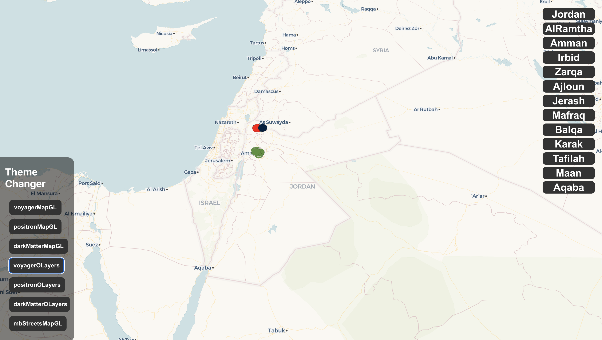
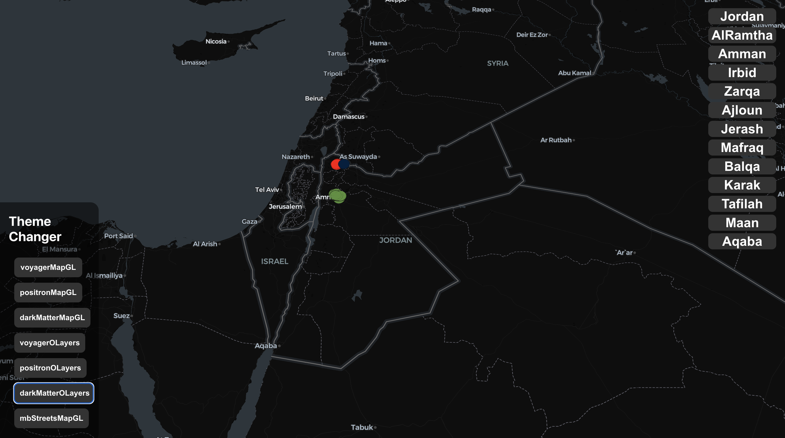
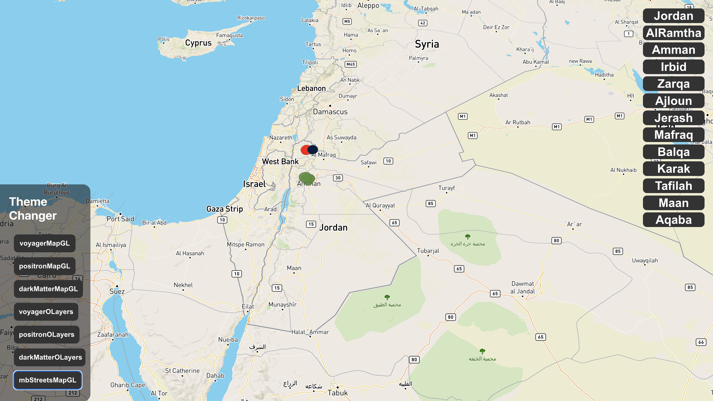
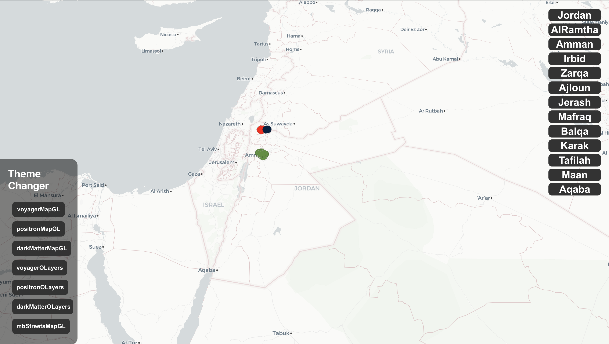
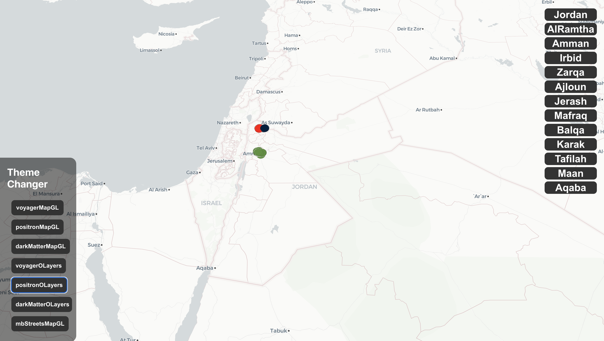
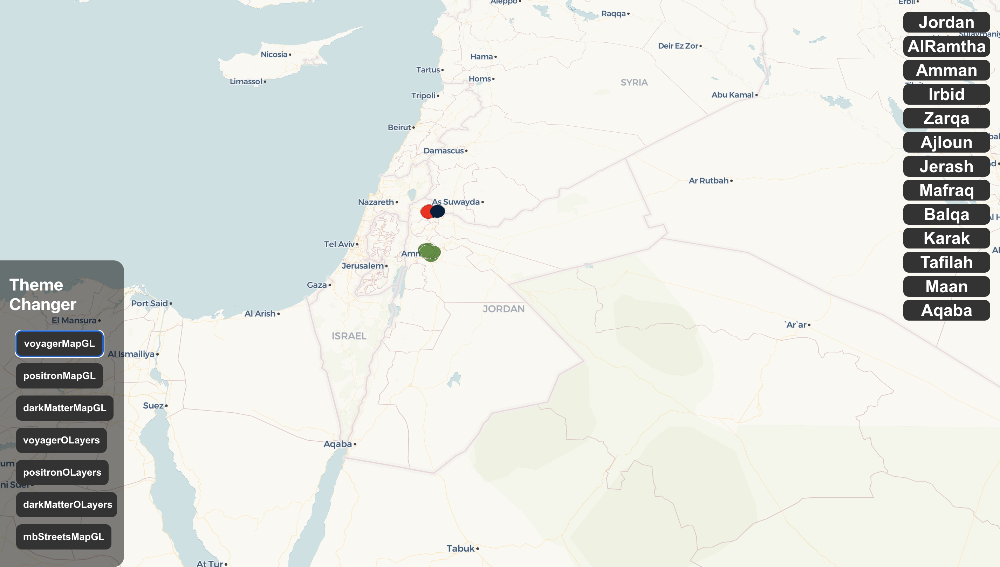

# Jordan Parks Explorer

The **Jordan Parks Explorer** is a React-based web application that allows users to explore and visualize parks and landmarks in Jordan using Mapbox and Deck.gl. The application provides an interactive map interface with the ability to fly to different locations, change map styles, and view details about specific points of interest.

## Final Output












## Features

- **Interactive Map**: Utilizes Mapbox for a dynamic and interactive map interface.
- **Location Exploration**: Users can seamlessly transition between predefined locations in Jordan, offering a convenient way to explore various areas.
- **Map Style Customization**: The application supports different map styles, allowing users to switch between themes for a personalized viewing experience.
- **Data Visualization**: Parks and landmarks are visualized on the map using Deck.gl's GeoJsonLayer, with distinct colors indicating different types of locations.

## Installation

1. Clone the repository:

   ```bash
   git clone https://github.com/mansourelbash/react-deckgl-map-mapbox
   ```

2. Install dependencies:

   ```bash
   npm install
   ```

3. Add your Mapbox access token in the `.env` file:

   ```
   REACT_APP_MAPBOX_ACCESS_TOKEN=your-mapbox-access-token
   ```

4. Run the application:

   ```bash
   npm start
   ```

5. Open your browser and navigate to [http://localhost:3000](http://localhost:3000).

## Usage

- Explore different locations by clicking on the provided buttons that represent specific areas in Jordan.
- Change the map style by selecting different themes from the available options.

## Code Overview

- **App.js**: The main component containing the logic for the interactive map, location buttons, and map style changes.
- **location.js**: Defines predefined locations in Jordan.
- **uichanges.js**: Defines different map style options.
- **data.json**: Contains the geographical data for Jordan parks and landmarks.

## Dependencies

- [React](https://reactjs.org/)
- [Mapbox](https://www.mapbox.com/)
- [Deck.gl](https://deck.gl/)

## Contributing

If you'd like to contribute to this project, please follow the [Contributing Guidelines](CONTRIBUTING.md).

## License

This project is licensed under the [MIT License](LICENSE).

## Acknowledgments

- The application uses Mapbox for its mapping services.
- Deck.gl provides powerful data visualization capabilities.
- Special thanks to the Jordan Parks and Landmarks dataset for enriching the user experience.

## Contact

For any inquiries or feedback, please contact [mansour.programmer@gmail.com](mailto:mansour.programmer@gmail.com).

---

Feel free to customize this README further based on additional details or features of your project. Ensure to replace placeholders with your actual information.